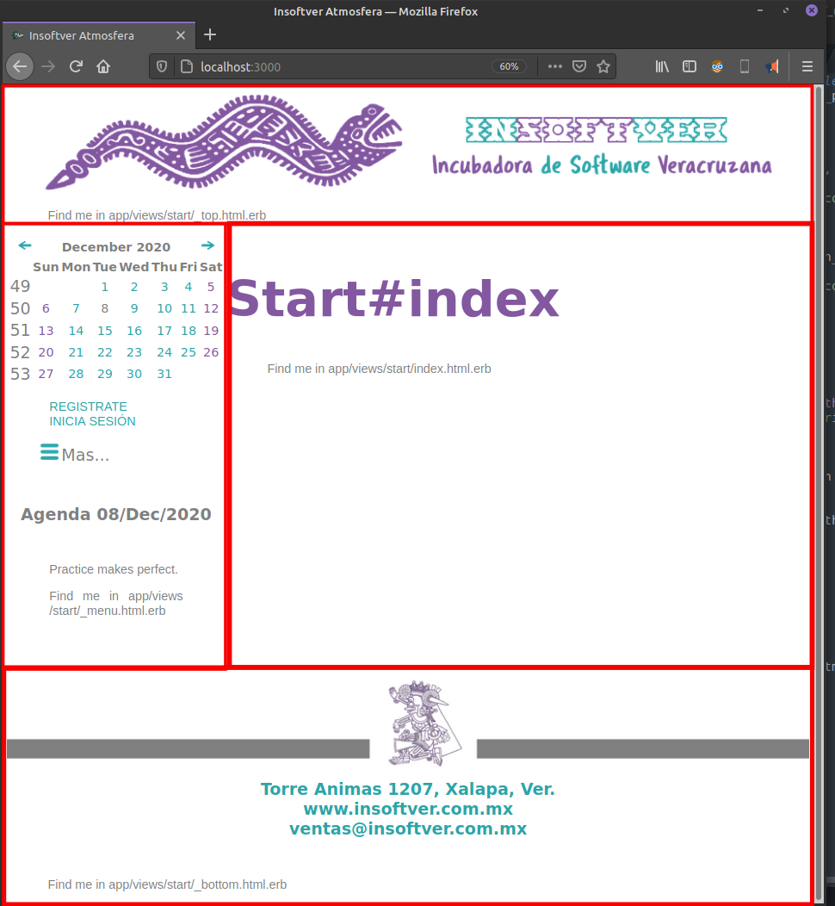
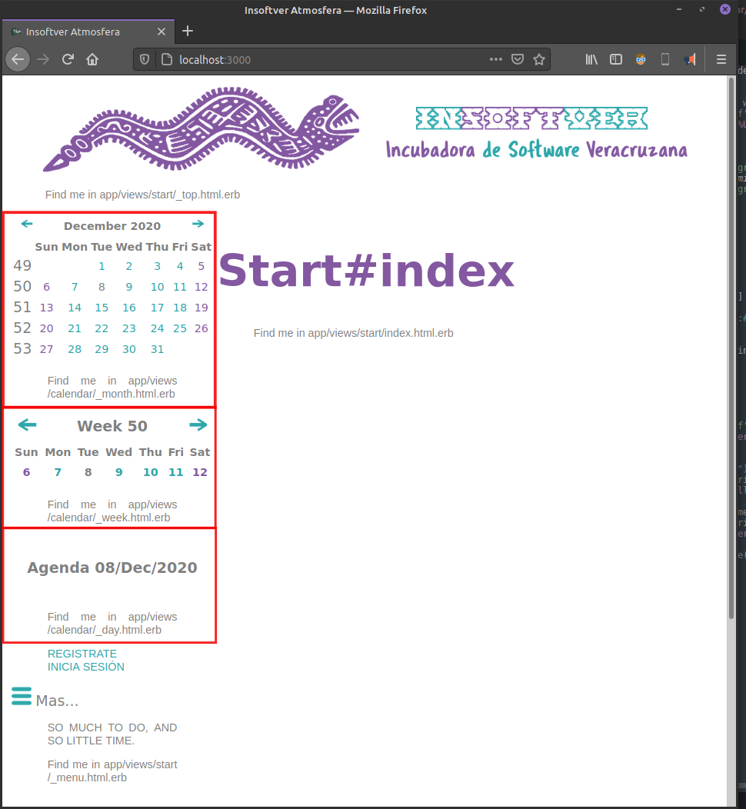

 
<h1>Atmosfera</h1>
<h3>RubyOnRails simple environment.</h3>

This gem is aimed to help future Insoftver developers to avoid initialization of a RubyOnRails server environment. Its intention is to reduce these tasks to generators. While building it SCRUM Agile Methodology was implemented, so it will be updated on that pace.

<h3>Information</h3>

	This gem generates a controller called Start and sets its index.html.erb file up as root_path. 
	It applies to the Devise gem views the Insoftver CSS layouts. 
	It generates a calendar with three different views, month, week, and day, as well as an event planner.  
	More features will be added.

<h3>Getting started</h3>

Atmosfera 1.0 works with Rails 6.0 onwards. Add the following line to your Gemfile:

<blockquote>gem 'atmosfera'</blockquote>

<h3>Usage</h3>

	It is necessary to have a clean Rails project, if possible just created. After installation on the Gemfile some generators can be run, they will be listed and updated on this document. 
	<blockquote>rails generate atmosfera:start</blockquote>
	This generator will install the Start controller its views and apply the Insoftver CSS layouts to the Devise views. It sets the root_path to the Start controller index.html.erb file.
	It is necessary to know that we need to have previously installed the Devise gem. Once this last done, Atmosfera creates the following files:  
	<ul>
	app/assets/images/start
		 
		<li>250x250px icon.xcf file with the following exportings.</li>
		<li>favicon.png</li>
		<li>icon_cancel.png</li>
		<li>icon_finished.png</li>
		<li>icon_green_add.png</li>
		<li>icon_green_delete.png</li>
		<li>icon_green_edit.png</li>
		<li>icon_green_email.png</li>
		<li>icon_green_eyeglasses.png</li>
		<li>icon_green_left_arrow.png</li>
		<li>icon_green_menu.png</li>
		<li>icon_green_pause.png</li>
		<li>icon_green_phone.png</li>
		<li>icon_green_play.png</li>
		<li>icon_green_right_arrow.png</li>
		<li>icon_green_search.png</li>
		<li>icon_green_statistics.png</li>
		<li>icon_green_stop.png</li>
		<li>icon_in.png</li>
		<li>icon_ongoing.png</li>
		<li>icon_out.png</li>
		<li>icon_red_pause.png</li>
		<li>icon_red_stop.png</li>
		 
		<li>250x250px social.xcf file with the following exportings.</li>
		<li>social_facebook.png</li>
		<li>social_twitter.png</li>
		<li>social_wattsapp.png</li>
		<li>social_youtube.png</li>
		 
		<li>1920x1080px landscape_background.xcf file and landscape_background.png</li>
		<li>1920x250px landscape_footer.xcf file and landscape_footer.png</li>
		<li>1920x250px landscape_header.xcf file and landscape_header.png</li>
		<li>250x600px portrait_background.xcf file and portrait_background.png</li>
		<li>250x200px portrait_footer.xcf file and portrait_footer.png</li>
		<li>250x200px portrait_header.xcf file and portrait_header.png</li>
		<li>250x250px logo_250x250_short_name.xcf file and logo_250x250_short_name.png</li>
		<li>960x1080px logo_960x1080_short_name.xcf file and logo_960x1080_short_name.png</li>
		<li>250x250px no_user_photo.xcf file and no_user_photo.png</li>
		<li>250x250px no_item_photo.xcf file and no_item_photo.png</li>
	</ul>
	<ul>
	app/assets/stylesheets
		 
		<li>start.scss - This file contents the CSS Insoftver layout.</li>
	</ul>
	<ul>
	app/controllers
		 
		<li>start_controller.rb</li>
	</ul>	
	<ul>
	app/views/start
		 
		<li><b>index.html.erb</b> This file will display your starting content, it is aimed to be your landing page.</li>
		<li><b>_menu.html.erb</b> This file is great to display all the different links to your different controllers and views.</li>
		<li><b>_top.html.erb</b> This is the right place to put your header image and company name.</li>
		<li><b>_bottom.html.erb</b> This place may content some footer image and some contact data.</li>
	</ul>
	This generator will modify the app/layouts/application.html.erb file as well in order to customize it to the Insoftver CSS and formats. The layout sketch generated by this tool may look like the following image:  
	 
	NOTE: It is neccesary to execute the <b>rake routes</b> command on the terminal in order to set the changes done in the routes.rb file.  
	After installing all the files listed before, the gem will replace the default Devise views with the previously customized. The files will be replaced according to the gem version list below.  
	<ul>
	app/views/devise/confirmations (V1.0).
		<li>new.html.erb</li> 
	app/views/devise/mailer (V2.0).
		<li>confirmation_instructions.html.erb</li>
		<li>email_changed.html.erb</li>
		<li>password_change.html.erb</li>
		<li>reset_password_instructions.html.erb</li>
		<li>unlock_instructions.html.erb</li> 
	app/views/devise/passwords (V2.0).
		<li>edit.html.erb</li>
		<li>new.html.erb</li> 
	app/views/devise/registrations (V1.0).
		<li>edit.html.erb</li>
		<li>new.html.erb</li> 
	app/views/devise/sessions (V1.0).
		<li>new.html.erb</li> 
	app/views/devise/shared (V1.0).
		<li>_error_messages.html.erb</li>
		<li>_links.html.erb</li> 
	app/views/devise/unlocks (V2.0).
		<li>new.html.erb</li> 
	</ul>
	<blockquote>rails generate atmosfera:calendar</blockquote>
	This generator will install the Calendar controller its views with the Insoftver CSS layouts. It creates the following files:  
	<ul>
	On the app/assets/stylesheets/ folder:
		 
		<li>calendar.scss</li>
	</ul>
	<ul>
	On the app/controllers/ folder:
		 
		<li>calendar_controller.rb</li>
	</ul>	
	<ul>
	On the app/views/calendar/ folder:
		 
		<li><b>start.html.erb</b> This is the calendar landing page.</li>
		<li><b>_month.html.erb</b> This view is the typical wall calendar month view.</li>
		<li><b>_week.html.erb</b> This is a week view, it will content a start_time value if some event is scheduled for that week. </li>
		<li><b>_day.html.erb</b> This is a week view, it will content data if some event is scheduled for that day.</li>
	</ul>
	The layout sketch generated by this tool may look like the following image:  
	 	
	NOTE: It is neccesary to execute the <b>rake routes</b> command on the terminal in order to set the changes done in the routes.rb file.  	

	<h3>Locales</h3>
	Atmosfera by default will configure the Devise gem internationalization for Spanish Language. However it is necessary to setup the timezone and locals on some files after installation.  
	On the config/application.rb file add the following code in order setup the time according to your prefered timezone.
	<blockquote>
		 
		# Setting local timezone 
    	config.time_zone = 'America/Mexico_City' 
    	config.active_record.default_timezone = :local 
    	config.beginning_of_week = :sunday 
		     	
	</blockquote>
	On the same file you may add the following code in order to setup the locales.
	<blockquote>
		 
    	# Setting locales 
    	config.i18n.available_locales = [:en, :es] 
    	config.i18n.default_locale = :en 
    	# If some translation is not found sets the default instead of display nothing or error 
    	config.i18n.fallbacks = true 
		     	
	</blockquote>
	After that, it is necesary to set the way we are going to choose some local, there will be two methods by default. First one is using <b>params[:lang]</b> to set the language two letter prefix (:en, :es, :de). Second will be using the HTTP_ACCEPT_LANGUAGE method referenced <a href="https://developer.mozilla.org/en-US/docs/Web/HTTP/Headers/Accept-Language">here</a> In order to make these changes the following modifications must be done.
	On the app/controllers/application_controller.rb file add the following code.
	<blockquote>
		 
		# Setting locales 
		before_action :set_locale 
		 
		def set_locale 
 		# Locales can be set from params if given 
 		I18n.locale = params[:lang] || locale_from_header 
		end 
		 
		def locale_from_header 
 		# This function gets the locale from the browser according to this reference: 
 		# https://developer.mozilla.org/en-US/docs/Web/HTTP/Headers/Accept-Language 
 		# The regular expresion [a-z]{2} gets the short name of the language => es-CH, es;q=0.9, en;q=0.8, *;q=0.5 
  		request.env.fetch('HTTP_ACCEPT_LANGUAGE', '').scan(/[a-z]{2}/).first 
		end 
		     	
	</blockquote>
	Note: It may be neccesary to restart the server after these changes. 
<h3>Menu</h3>

Atmosfera _menu.html.erb file is almost empty, it just contains the devise login links. Here is the right place to put your own project links. Some examples of that could be: 

<ul>
	<li>Pricing</li>
	<li>Products</li>
	<li>Services</li>
	<li>About us</li>
	<li>Contact</li>
</ul>
 
<h3>Releases</h3>
<table style="width:100%">
	<tr>
    	<td>1st. Release.</td>
    	<td>
    		

    		Creation of Start controller files. 
    		Customization of the <a href="https://github.com/heartcombo/devise">Heartcombo's Devise</a> gem. 
    		Creation of the calendar and setup of events. 
	    	

    	</td>
  	</tr>
	<tr>
    	<td>2nd. Release.</td>
    	<td>
    		

    		Addition of JQuery routines. 
    		Addition of the responsive modules. 
    		Setup of the user profile module. 
    		

    	</td>
  	</tr>  
</table>